```{r setup, include=FALSE}
options(htmltools.dir.version = FALSE)
htmltools::tagList(rmarkdown::html_dependency_font_awesome())
```


class: normal, center

# Motivation

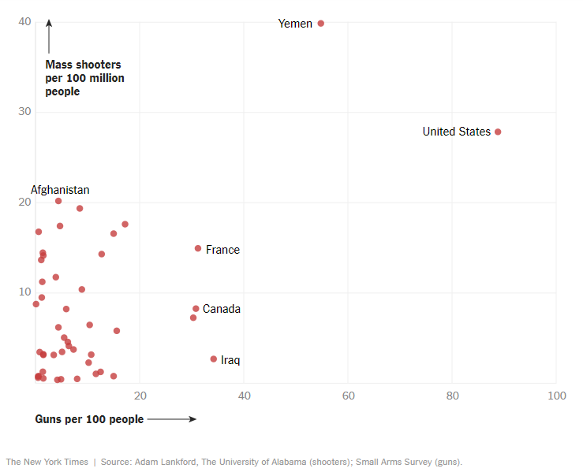


https://www.nytimes.com/2017/11/07/world/americas/mass-shootings-us-international.html

---
class: normal, center

<table>
<tr>
 <td valign="top">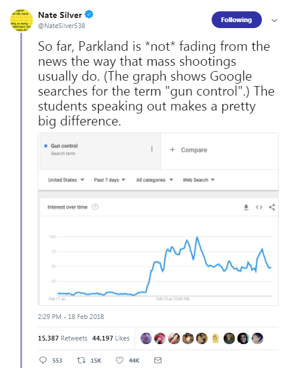</td>
 <td valign="top">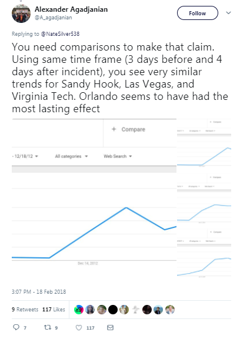</td>
</tr>
<tr> 
<td valign="bottom">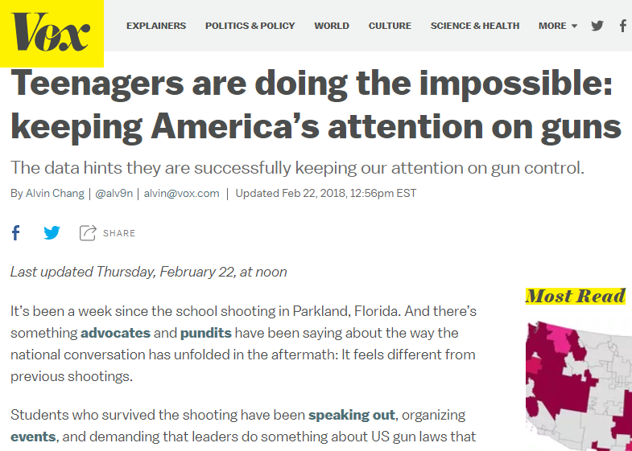</td>
 <td valign="bottom">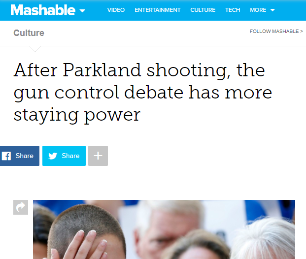</td>
</tr>
</table>

.small[https://www.vox.com/policy-and-politics/2018/2/21/17033308/florida-shooting-media-gun-control,

https://mashable.com/2018/02/19/parkland-students-gun-control-debate-google-trends/]

---

class: normal, center

<table>
<tr>
 <td valign="top">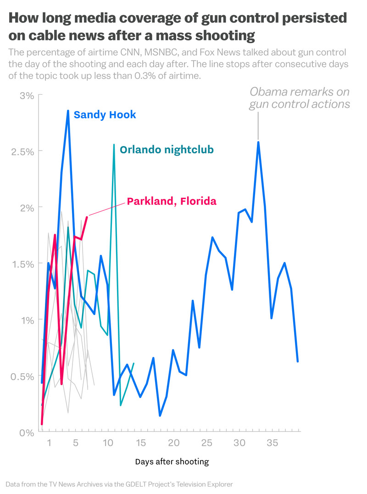</td>
 <td valign="top">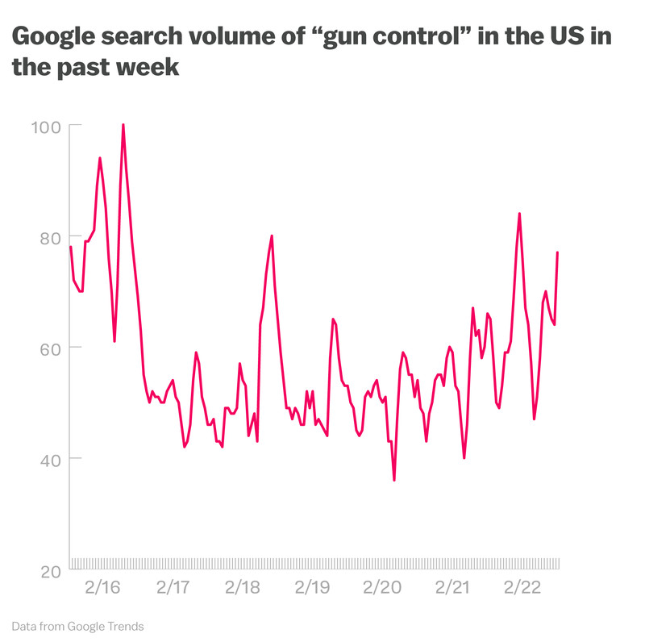</td>
</tr>
<tr> 
<td valign="top">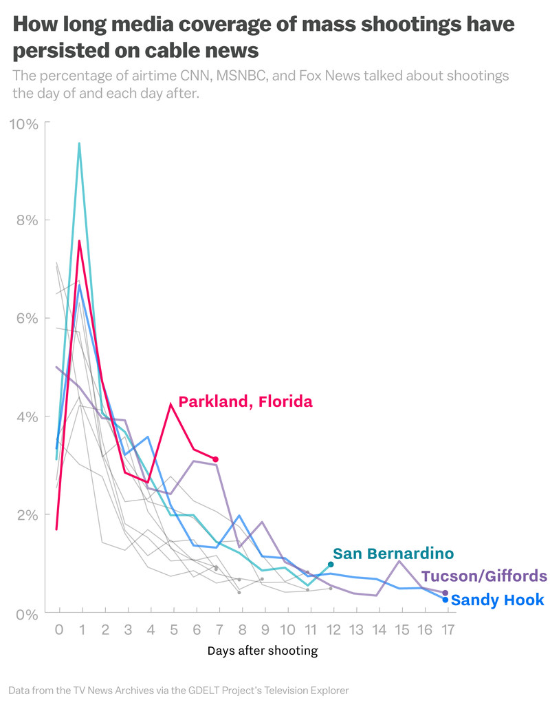</td>
<td valign="top">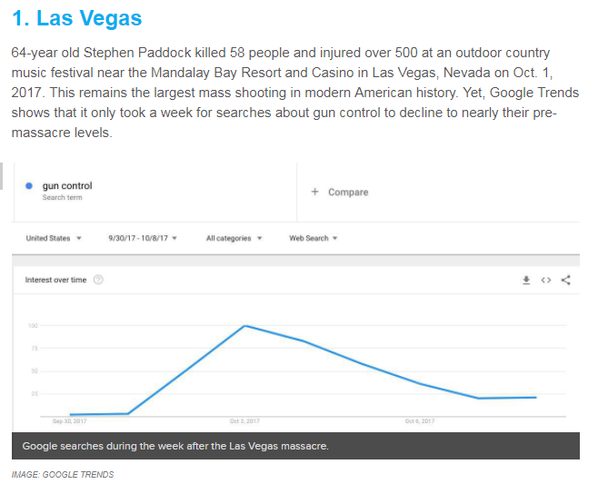</td>
</tr>
</table>


---

class: normal

# How can R help us understand when this situation might change?

.large[<i class="fa fa-wrench"></i> [Make the code immediately reproducible by anyone, anywhere](https://mybinder.org/)]          
.large[<i class="fa fa-wrench"></i> [Google search trends](https://github.com/PMassicotte/gtrendsR)]     
.large[<i class="fa fa-wrench"></i> [Wikipedia page views](https://github.com/petermeissner/wikipediatrend)]       
.large[<i class="fa fa-wrench"></i> [Broadcast news airtime](https://github.com/hrbrmstr/newsflash)]     
   

---

class: normal

# Immediately reproducible

.large[<i class="fa fa-flask"></i> [Binder](https://mybinder.org/) builds a Docker image from my GitHub repo]      
.large[<i class="fa fa-thumbs-up"></i> Low friction interaction with a specified computational environment]      
.large[<i class="fa fa-link"></i> Follow along at http://bit.ly/rstats-public-interest]     


---
class: normal

Data from the Mother Jones article [US Mass Shootings, 1982-2018: Data From Mother Jones’ Investigation](https://www.motherjones.com/politics/2012/12/mass-shootings-mother-jones-full-data/)


```{r eval=TRUE, tidy=FALSE, cache=TRUE, echo=FALSE, message=FALSE, fig.height=3.5, fig.width=10}
library(tidyverse)
library(lubridate)
library(glue)
# We just get it once from the web and save locally
us_mass_shootings <-readr::read_csv("https://docs.google.com/spreadsheet/pub?key=0AswaDV9q95oZdG5fVGJTS25GQXhSTDFpZXE0RHhUdkE&output=csv")

# format the date column as a date class
us_mass_shootings$Date <- mdy(us_mass_shootings$Date)

# write_csv(us_mass_shootings, "us_mass_shootings.csv")
# us_mass_shootings <- read_csv("data/us_mass_shootings.csv")

# tidy a few variables 
us_mass_shootings <- 
  us_mass_shootings %>% 
  mutate(Venue = str_trim(Venue)) %>% 
  mutate(Case = glue('{Case} ({year(Date)})'))

library(plotly)
theme_set(theme_minimal(base_size = 10))

p0 <- 
  ggplot(us_mass_shootings,
         aes(Year)) +
  geom_bar() +
  ylab("Number of mass shooting\nevents per year")
ggplotly(p0)

p2 <- 
ggplot(us_mass_shootings,
       aes(Date, 
           Fatalities, 
           label = Case)) +
  geom_point() +
  geom_smooth() +
    ylab("Number of fatalities\nper mass shooting event") +
  xlab("Date")

ggplotly(p2)
```

---
class: normal

# <i class="fa fa-music"></i> Side note: interactive plots

```{r eval = FALSE, tidy = FALSE}
library(ggplot2)
library(plotly)

p0 <- 
  ggplot(us_mass_shootings,
         aes(Year)) +
  geom_bar() +
  ylab("Number of mass shooting events per year") +
  theme_minimal(base_size = 14)

ggplotly(p0)
```

---
class: normal

`r nrow(us_mass_shootings)` mass shooting events in the data. School shootings seem clustered.

```{r eval=TRUE, tidy=FALSE, cache=TRUE, echo=FALSE, message=FALSE,  fig.width=10}
theme_set(theme_minimal(base_size = 14))

p1 <- 
ggplot(us_mass_shootings,
       aes(Date, 
           Venue, 
           label = Case)) +
  geom_point() +
  xlab("Date")
ggplotly(p1)
```


---
class: normal

# Google search trends

.mediumish[<i class="fa fa-archive"></i> [gtrendsR](https://github.com/PMassicotte/gtrendsR) by Philippe Massicotte and Dirk Eddelbuettel to perform and display Google Trends queries]    
.mediumish[<i class="fa fa-thumbs-up"></i> Easy to get data from the API]      
.mediumish[<i class="fa fa-thumbs-down"></i> Issues with resolution (month-day) and scale (0-100 per query only)]    


---
class: normal, center


```{r eval=TRUE, tidy=FALSE, cache=TRUE, echo=FALSE, message=FALSE,  fig.width=10}
n_events <- 50 # gets back to Sandy Hook
last_ten_shooting_dates <- us_mass_shootings$Date[1:n_events]

# get date before event to show baseline
Query_start_date <- last_ten_shooting_dates - weeks(1)

# get date after event
Query_end_date <- last_ten_shooting_dates + months(2)

# if the date is in the future, set it to today
Query_end_date <- if_else(Query_end_date >  today(),  today(), Query_end_date)

# prepare data frame
search_intervals <- 
data_frame(Case = us_mass_shootings$Case[1:n_events],
           Query_start_date = Query_start_date,
           Event_date = last_ten_shooting_dates, 
           Query_end_date = Query_end_date) %>% 
  filter(!is.na(Event_date),
         !is.na(Query_start_date),
         !is.na(Query_end_date))
```

```{r eval=TRUE, tidy=FALSE, cache=TRUE, echo=FALSE, message=FALSE,  fig.width=10}
library(gtrendsR)

# we only get one data point per month, ok for long term trends, 
# but not for daily 
google.trends = gtrends(c("gun control"), 
                        gprop = "web", 
                        time = "all")
 
search_results_over_time <- google.trends$interest_over_time
search_results_over_time$the_date <- as.character(search_results_over_time$date)
```

```{r eval=TRUE, tidy=FALSE, cache=TRUE, echo=FALSE, message=FALSE,  fig.width=10}
theme_set(theme_minimal(base_size = 14))
# prepare vertical lines to show when the events occurred
vlines <- 
  search_intervals %>% 
  filter(Case %in% us_mass_shootings$Case[us_mass_shootings$Fatalities >= 10]) %>% 
  mutate(x = Event_date,
         y = seq(50, 100, length.out = nrow(.)),
        label = Case) 

p4 <- 
ggplot(search_results_over_time,
       aes(date,
           hits, 
           label = the_date)) +
  geom_vline(xintercept = vlines$Event_date,
             colour = "red") +
  geom_point() +
  geom_line() +
  ylab("Google search volume for 'gun control'") +
  xlab("Date") +
  ggtitle("The Sandy Hook event resulted in the most Google search volume for 'gun control'")

# get a halo on the text https://stackoverflow.com/a/10691826/1036500
theta <- seq(pi/8, 2*pi, length.out=16)
xo <- diff(range(vlines$x))/200
yo <- diff(range(vlines$y))/200
for(i in theta) {
  p4 <- p4 + geom_text( data = vlines,
    aes_q(x = bquote(x+.(cos(i)*xo)),
          y = bquote(y+.(sin(i)*yo)),
          label = ~label), 
    size=4, colour='white', hjust = 1)
}

p4 + geom_text(data = vlines,
          aes(x, 
              y, 
              label = label), 
          hjust = 1,
          size = 4,
          colour = "black")
```
---
class: normal

# <i class="fa fa-music"></i> Side note: text halos in ggplot

```{r eval=FALSE, tidy = FALSE}
library(ggplot2)
g <-  ggplot(...) 

# get a halo on the text https://stackoverflow.com/a/10691826/1036500
theta <- seq(pi/8, 2*pi, length.out=16)
xo <- diff(range(my_data_frame$x))/200
yo <- diff(range(my_data_frame$y))/200
for(i in theta) {
  g <- g + geom_text( data = my_data_frame,
    aes_q(x = bquote(x+.(cos(i)*xo)),
          y = bquote(y+.(sin(i)*yo)),
          label = ~label), 
    size=4, colour='white', hjust = 1)
}

g + geom_text(..., colour = "black")

```


---
class: normal

# Small multiples to show the decay in Google search activity 

```{r eval=TRUE, tidy=FALSE, cache=TRUE, echo=FALSE, message=FALSE,  fig.width=10, warning=FALSE}
theme_set(theme_minimal(base_size = 14))
# get search results for each shooting event, one data point per day
# much more useful for looking at persistence of interest after event
# this may take a few minutes...
library(glue)
library(purrrlyr)
search_results_over_time_with_cases <- 
by_row(search_intervals,
    ~gtrends(c("gun control"), 
             gprop = "web", 
             time = glue('{.x$Query_start_date} {.x$Query_end_date}'))
    ) 
```


```{r eval=TRUE, tidy=FALSE, cache=TRUE, echo=FALSE, message=FALSE,  fig.width=10, warning=FALSE}
theme_set(theme_minimal(base_size = 14))
# extract interest-over-time data frames and 
# unnest into one big df, and
# get days since event
search_results_over_time_with_cases_iot <- 
search_results_over_time_with_cases %>% 
  mutate(interest_over_time = map(.out, ~.x$interest_over_time)) %>% 
  unnest(interest_over_time) %>% 
  mutate(days_relative_to_event = ymd(date) - ymd(Event_date))

# small mulitples
ggplot(search_results_over_time_with_cases_iot %>% 
           filter(Case %in% us_mass_shootings$Case[us_mass_shootings$Fatalities >= 10]) %>% 
           mutate(Case = str_wrap(Case, 20)) %>% 
           mutate(Case = fct_reorder(Case, year(Event_date))),
       aes(days_relative_to_event,
           hits,
           colour = Case)) +
  geom_line() +
  geom_vline(xintercept = 0, 
             colour = "red") +
  geom_smooth(alpha=0.3, 
              linetype=0) +
  stat_smooth(geom="line", 
              alpha=0.3, 
              size = 2) +
  facet_wrap( ~Case) +
  guides(colour="none") +
  ylim(0, 100) +
  ylab("Google search volume for 'gun control'\n(100 is local maximum for each event)") +
  xlab("Days relative to event (red vertical line is the day of the event)") +
  theme(strip.text.x = element_text(size = 8))
```

---
class: normal

# <i class="fa fa-music"></i> Side note: iterate by row

```{r eval=FALSE, tidy=FALSE}
library(gtrendsR)
library(glue)
library(purrrlyr)
search_results_over_time_with_cases <- 
by_row(search_intervals,
    ~gtrends(c("gun control"), 
             gprop = "web", 
             time = glue('{.x$Query_start_date} {.x$Query_end_date}'))
    ) 
```

---
class: normal

# Interactive overlay to compare decay in Google search activity

```{r eval=TRUE, tidy=FALSE, cache=TRUE, echo=FALSE, message=FALSE,  fig.width=10, warning=FALSE}
theme_set(theme_minimal(base_size = 8))
p5 <- # all on one
  ggplot(search_results_over_time_with_cases_iot %>% 
           filter(Case %in% us_mass_shootings$Case[us_mass_shootings$Fatalities >= 10]) %>% 
           mutate(Case = str_trunc(Case, 10)),
         aes(days_relative_to_event,
             hits,
             colour = Case)) +
  geom_line(alpha = 0.9) +
  geom_vline(xintercept = 0, 
             colour = "red") +
  ylab("Google search volume for 'gun control'") +
  xlab("Days relative to event (red vertical line is the day of the event)") +
  guides(colour=FALSE)
ggplotly(p5)
```
---
class: normal

# Wikipedia page views

.mediumer[<i class="fa fa-archive"></i> [pageviews](https://github.com/Ironholds/pageviews/) by Oliver Keyes to search and download article page view counts of Wikipedia and its sister projects]    
.mediumer[<i class="fa fa-wikipedia-w"></i> One of the most popular sites on the Web to satisfy information needs]      
.mediumer[<i class="fa fa-thumbs-down"></i> Current API limited to 2015 onward]    

---
class: normal

# <i class="fa fa-music"></i> Side note: reading large text files

```{r eval = FALSE, tidy = FALSE}
# https://gist.github.com/benmarwick/20eac969ce9199756dc074801f5b531d
library(chunked)
library(tidyverse)

my_file <- 'pagecounts-2012-12-14/pagecounts-2012-12-14' # 3.5 GB

# to find where the content starts, vary the skip value, 
read.table(my_file, nrows = 10, skip = 25)

# work on chunks of the file
df <- 
read_chunkwise(my_file, 
               chunk_size=5000,
               skip = 30,
               format = "table",
               header = TRUE) %>% 
  filter(stringr::str_detect(De.mw.De.5.J3M1O1, "Gun_control"))

```


---
class: normal, center

```{r eval=TRUE, tidy=FALSE, cache=TRUE, echo=FALSE, message=FALSE,  fig.width=10, warning=FALSE}
library(pageviews) # only goes back to 2015

pages <- c("Gun_control", 
           "Gun_violence_in_the_United_States",
           "Mass_shootings_in_the_United_States",
           "Second_Amendment_to_the_United_States_Constitution")

trend_data <- 
article_pageviews(project = "en.wikipedia",
                  article = pages, 
                  platform = "all",
                  user_type = "all",
                  start = as.Date(min(search_intervals$Query_start_date)), 
                  end =   as.Date(today()))

trend_data$date <-  ymd(trend_data$date)
```

```{r eval=TRUE, tidy=FALSE, cache=TRUE, echo=FALSE, message=FALSE,  fig.width=10, warning=FALSE}
theme_set(theme_minimal(base_size = 14))
# prepare vertical lines to show when the events occurred
n <- 30
vlines <- 
  data_frame(x = search_intervals$Event_date[1:n],
             y = seq(1e5, 1, length.out = n),
             label = search_intervals$Case[1:n])
p11 <- 
ggplot(trend_data,
       aes(date,
           views,
           colour = article)) +
  geom_vline(data = search_intervals,
             aes(xintercept = Event_date),
             colour = "red",
             alpha = 0.3) +
  geom_line(size = 1)  +
  xlim( min(trend_data$date), max(trend_data$date) ) +
  scale_colour_discrete(guide = guide_legend()) +
  ylab("Page views for Wikipedia articles\nrelated to gun control") +
  xlab("Date") +
  labs(colour = "Wikipedia article") +
  theme(legend.position = c(0.2, 0.8),
        legend.text = element_text(size = 7),
        legend.key.height = unit(0.5,"line")) +
  ggtitle("The Stoneman Douglas event resulted in the most Wikipedia\npage views for 'gun control' articles (2015-present)")

# get a halo on the text https://stackoverflow.com/a/10691826/1036500
theta <- seq(pi/8, 2*pi, length.out=16)
xo <- diff(range(vlines$x))/200
yo <- diff(range(vlines$y))/200
for(i in theta) {
  p11 <- p11 + geom_text( data = vlines,
    aes_q(x = bquote(x+.(cos(i)*xo)),
          y = bquote(y+.(sin(i)*yo)),
          label = ~label), 
    size=3, colour='white', hjust = 1)
}
p11 + geom_text(data = vlines,
          aes(x, 
              y, 
              label = label), 
          hjust = 1,
          size = 3,
          colour = "black")
```

---
class: normal, center

```{r eval=TRUE, tidy=FALSE, cache=TRUE, echo=FALSE, message=FALSE,  fig.width=10, warning=FALSE}
theme_set(theme_minimal(base_size = 14))
library(fuzzyjoin)

wikipedia_traffic_for_events <- 
fuzzy_left_join(trend_data,
                search_intervals, 
                by = c("date" = "Query_start_date", 
                       "date" = "Query_end_date"), 
                match_fun = list(`>=`, `<`)) %>% 
  mutate(days_relative_to_event = ymd(date) - ymd(Event_date))

wiki_traffic_total_views_over_days <- 
wikipedia_traffic_for_events %>% 
  group_by(Case, days_relative_to_event) %>% 
  summarise(total_views = sum(views)) %>% 
  filter(!is.na(Case))

p6 <- 
ggplot(wiki_traffic_total_views_over_days %>% 
           filter(Case %in% us_mass_shootings$Case[us_mass_shootings$Fatalities >= 10]),
       aes(days_relative_to_event,
           total_views, 
           colour = Case)) +
  geom_vline(xintercept = 0,
             colour = "red") +
  geom_line(alpha = 0.9) +
  ylab("Page views for Wikipedia articles\nrelated to gun control") +
  xlab("Days relative to event\n(red vertical line is the day of the event)") 
ggplotly(p6) 
```
---
class: normal

# <i class="fa fa-music"></i> Side note: non-equi joins

```{r eval = FALSE, tidy = FALSE}
# https://stackoverflow.com/q/41132081/1036500
library(tidyverse)
    elements <- c(0.1, 0.2, 0.5, 0.9, 1.1, 1.9, 2.1)
    intervals <-  frame_data(~phase, ~start, ~end,
                               "a",     0,     0.5,
                               "b",     1,     1.9,
                               "c",     2,     2.5)

library(fuzzyjoin)
fuzzy_left_join(data.frame(elements), 
                intervals, 
                by = c("elements" = "start", 
                       "elements" = "end"), 
                match_fun = list(`>=`, `<=`)) %>% 
  distinct()

##     elements phase start end
## 1      0.1     a     0   0.5
## 2      0.2     a     0   0.5
## 3      0.5     a     0   0.5
## 4      0.9  <NA>    NA    NA
## 5      1.1     b     1   1.9
## 6      1.9     b     1   1.9
## 7      2.1     c     2   2.5

```


---
class: normal

# Do mass shootings with more fatalities result in more page views?

```{r eval=TRUE, tidy=FALSE, cache=TRUE, echo=FALSE, message=FALSE,  fig.width=10, warning=FALSE}
theme_set(theme_minimal(base_size = 14))
wiki_traffic_and_mass_shooting_data <- 
wikipedia_traffic_for_events %>% 
  group_by(Case) %>% 
  summarise(total_views = sum(views)) %>% 
  left_join(us_mass_shootings) 

p7 <- 
ggplot(wiki_traffic_and_mass_shooting_data %>% filter(!is.na(Case)),
       aes(total_views,
           Fatalities, 
           label = Case)) +
  geom_point(size = 3) +
  geom_smooth(method = "glm") +
  ylab("Fatalities") +
  xlab("Page views for Wikipedia articles related to gun control") 
ggplotly(p7)
```
---

class: normal

# Broadcast television news coverage 

.mediumer[<i class="fa fa-archive"></i> [newsflash](https://github.com/hrbrmstr/newsflash) by Bob Rudis for tools to work with the Internet Archive and GDELT Television Explorer]    
.mediumer[<i class="fa fa-tv"></i> Keyword search the closed captioning streams, daily data going back to 2009 for MSNBC, CNN and FOX]      
.mediumer[<i class="fa fa-question-circle"></i> Measurement variable is % airtime (15 second blocks)]    

---

class: normal, center

```{r eval=TRUE, tidy=FALSE, cache=TRUE, echo=FALSE, message=FALSE,  fig.width=10, warning=FALSE}
tv_data <- read_csv("images/results.csv")
tv_data$Date <- ymd(tv_data$Date)

tv_data_for_events <- 
fuzzy_left_join(tv_data,
                search_intervals, 
                by = c("Date" = "Query_start_date", 
                       "Date" = "Query_end_date"), 
                match_fun = list(`>=`, `<`)) %>% 
  mutate(days_relative_to_event = ymd(Date) - ymd(Event_date)) 

tv_data_for_events$days_relative_to_event <- 
as.numeric(tv_data_for_events$days_relative_to_event)
```

```{r eval=TRUE, tidy=FALSE, cache=TRUE, echo=FALSE, message=FALSE,  fig.width=10, warning=FALSE}
theme_set(theme_minimal(base_size = 14))

p8 <- 
ggplot(tv_data_for_events %>% 
           filter(Case %in% us_mass_shootings$Case[us_mass_shootings$Fatalities >= 10]) %>% 
           mutate(Case = str_trunc(Case, 10)),
       aes(jitter(days_relative_to_event),
           Value,
           colour = Case)) +
  geom_line(alpha = 0.2) +
  geom_smooth(se = FALSE,
              span = 0.1) +
  geom_vline(xintercept = 0,
             colour = "red") +
  guides(colour = FALSE) +
  ylab("% airtime (15 second blocks)") +
  xlab("Days relative to event\n(red vertical line is the day of the event)")

# geom_vline doesn't seem to work with plotly here, not sure why,
# so we add it back in
ggplotly(p8, originalData = FALSE) %>%
  mutate(zero = min(y)) %>% 
  mutate(inf = max(y)) %>% 
  add_fun(function(p) {
    p %>% slice(which(x == 0))  %>% 
      add_segments(x = ~x, 
                   xend = ~x, 
                   y = ~zero, 
                   yend = ~inf,
                   colour = "red") 
  })
```
---
class: normal

# Summary

.largerer[☹️ There are too many mass shootings]      
.largerer[👉 Stoneman Douglas resembles previous mass shooting events in generating and sustaining public interest in gun control, as measured by Google search volume and TV broadcast news content.]      
.largerer[👉 Most striking difference between Stoneman Douglas and previous mass shootings is the high number of page views to Wikipedia articles]     
.largerer[<i class="fa fa-puzzle-piece"></i> If Sandy Hook didn't change anything, probably no single event will]

---
class: normal, center

# What do to?

<table>
<tr>
 <td valign="top">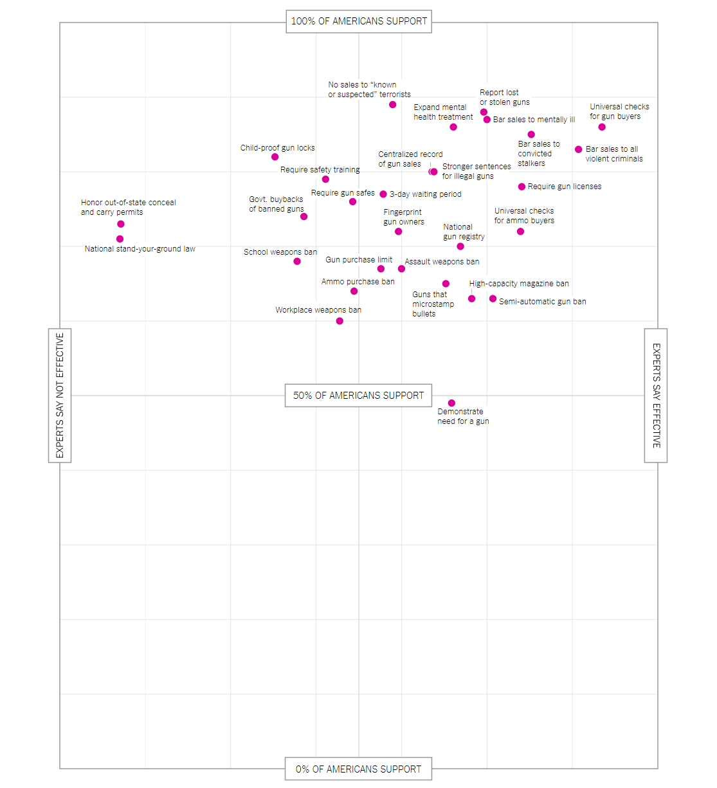</td>
 <td valign="top">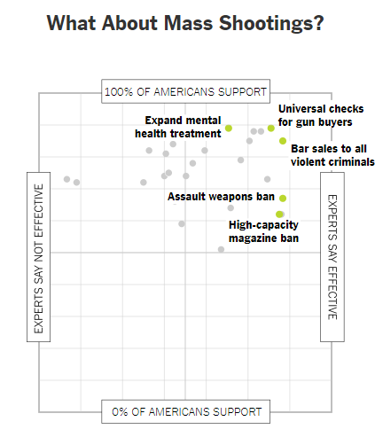</td>
</tr>
</table>

https://www.nytimes.com/interactive/2017/01/10/upshot/How-to-Prevent-Gun-Deaths-The-Views-of-Experts-and-the-Public.html, http://lawcenter.giffords.org/


---

class: normal

# Colophon

.larger[
Presentation written in [R Markdown using xaringan](https://github.com/yihui/xaringan)

Compiled into HTML5 using [RStudio](http://www.rstudio.com/ide/) & [knitr](http://yihui.name/knitr)

Source code hosting:
https://github.com/benmarwick/Seattle-UseR-Group-April-2018

ORCID: http://orcid.org/0000-0001-7879-4531

Licensing: 

* Presentation: [CC-BY-3.0](http://creativecommons.org/licenses/by/3.0/us/)

* Source code: [MIT](http://opensource.org/licenses/MIT) ]


